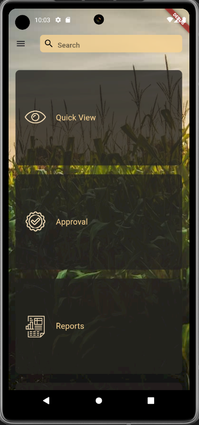
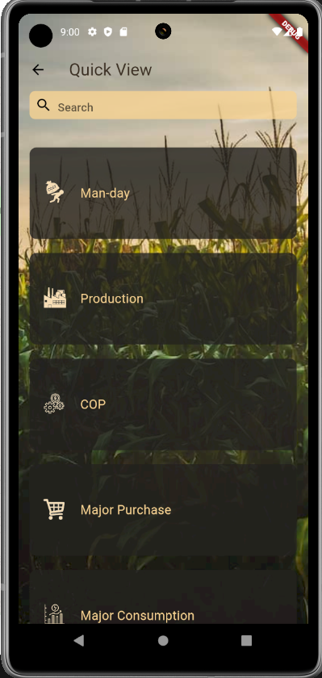
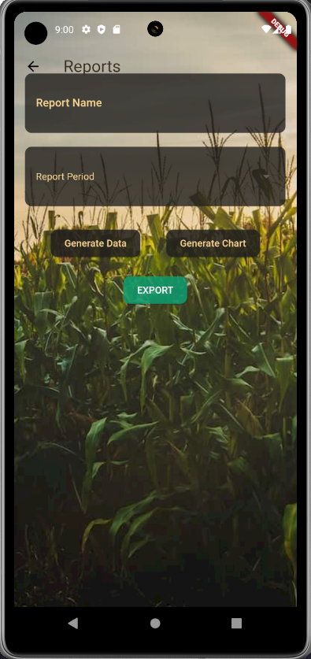
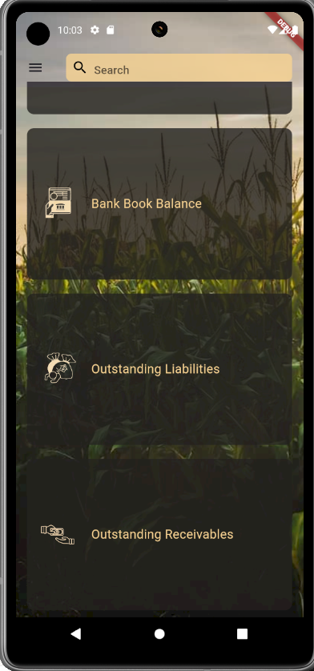

# iSmart - Business Management Application

<div align="center">


A comprehensive Flutter-based mobile application designed for business financial management and operations tracking.

[](https://flutter.dev)
[](https://dart.dev)
[](LICENSE)

</div>

## 📱 Screenshots

<div align="center">
  
| Login Screen | Dashboard | Quick View |
|:---:|:---:|:---:|
|  |  |  |

| Approval Module | Reports | Financial View |
|:---:|:---:|:---:|
|  |  |  |

</div>

## 🌟 Features

### 🏠 Dashboard
The main dashboard provides easy access to three primary modules:
- **Quick View**: Instant access to operational metrics
- **Approval**: Workflow management for various business processes
- **Reports**: Comprehensive reporting and analytics

### 📊 Quick View Module
Real-time operational monitoring with search functionality:

- **Man-day Tracking** 👷
  - Monitor workforce utilization
  - Track daily labor hours
  - Analyze productivity metrics

- **Production Management** 🏭
  - Track production outputs
  - Monitor production efficiency
  - Real-time production data

- **COP (Cost of Production)** ⚙️
  - Calculate production costs
  - Track cost variations
  - Cost optimization insights

- **Major Purchase** 🛒
  - Monitor significant purchases
  - Purchase history and trends
  - Vendor management

- **Major Consumption** 📊
  - Track material consumption
  - Inventory usage patterns
  - Resource optimization

### ✅ Approval Module
Streamlined approval workflows for critical business processes:

- **Cash Book Approval** 💵
  - Review cash transactions
  - Approve daily cash entries
  - Cash flow validation

- **Bank Book Approval** 🏦
  - Bank transaction verification
  - Multi-level bank entry approval
  - Reconciliation workflows

- **Invoice Approval** 📄
  - Purchase invoice review
  - Payment authorization
  - Vendor invoice management

- **Leave Approval** 📅
  - Employee leave requests
  - Absence management
  - Leave balance tracking

### 📈 Reports Module
Advanced reporting with data export capabilities:

**Report Generation Features:**
- **Custom Report Name**: Create and save custom reports
- **Report Period Selection**: Define date ranges for analysis
- **Generate Data**: Create detailed data tables
- **Generate Chart**: Visual data representation
- **Export Functionality**: Export reports in PDF format

**Available Reports:**
- Man-Day Reports
- Production Analytics
- Cost of Production Analysis
- Sales Performance
- Budget vs Actual Comparison
- Major Purchase/Consumption Reports
- Financial Statements
- Absence/Leave Reports

### 💰 Financial Management
- **Bank Book Balance**: Track and manage bank account transactions
- **Cash Book**: Monitor cash flow and daily cash transactions
- **Outstanding Liabilities**: Keep track of pending payments
- **Outstanding Receivables**: Monitor pending receipts from customers
- **Budget vs Actual**: Compare budgeted amounts with actual expenses

## 🛠️ Technology Stack

- **Framework**: Flutter 3.4.0+
- **Language**: Dart (>=3.4.0 <4.0.0)
- **Database**: SQLite (sqflite)
- **State Management**: Flutter's built-in state management
- **UI Components**: Material Design with custom themes

### 📦 Key Dependencies

```yaml
dependencies:
  flutter: sdk: flutter
  http: ^1.2.1                    # API communication
  google_fonts: ^6.2.1            # Custom fonts
  intl: ^0.19.0                   # Internationalization
  dropdown_search: ^5.0.6         # Advanced dropdowns
  pdf: ^3.10.8                    # PDF generation
  sqflite: ^2.3.3+1               # Local database
  lottie: ^2.2.0                  # Animations
  printing: ^5.6.2                # Print functionality
  email_validator: ^3.0.0         # Email validation
  fluttertoast: ^8.2.5           # Toast notifications
```

## 🚀 Getting Started

### Prerequisites

- Flutter SDK (3.4.0 or higher)
- Dart SDK (3.4.0 or higher)
- Android Studio / VS Code
- Android SDK / Xcode (for iOS development)

### Installation

1. **Clone the repository**
   ```bash
   git clone https://github.com/ARUNTHOMAS3/ismart.git
   cd ismart
   ```

2. **Install dependencies**
   ```bash
   flutter pub get
   ```

3. **Run the app**
   ```bash
   flutter run
   ```

### Build for Production

**Android:**
```bash
flutter build apk --release
```

**iOS:**
```bash
flutter build ios --release
```

## 📁 Project Structure

```
ismart/
├── lib/
│   ├── main.dart                    # Application entry point
│   ├── loginpage.dart              # User authentication
│   ├── dashboard.dart              # Main dashboard
│   ├── homescreen.dart             # Home screen
│   ├── quick view.dart             # Quick view module
│   ├── approval.dart               # Approval workflows
│   ├── Invoiceapproval.dart        # Invoice approval
│   ├── leaveapproval.dart          # Leave approval
│   ├── report.dart                 # Reports module
│   ├── bankbook.dart               # Bank book management
│   ├── cashbook.dart               # Cash book management
│   ├── manday.dart                 # Man-day tracking
│   ├── network.dart                # API integration
│   ├── help.dart                   # Help & support
│   └── logo.dart                   # Logo component
├── image/                          # App assets and images
│   ├── quickview.png
│   ├── approval.png
│   ├── reports.png
│   ├── man-day.png
│   ├── production.png
│   ├── cop.png
│   ├── majorpurchase.png
│   ├── majorconsumption.png
│   ├── cashbook.png
│   ├── bankbook.png
│   ├── invoice.png
│   ├── leave.png
│   └── welcome.json               # Lottie animation
├── android/                        # Android specific files
├── ios/                           # iOS specific files
├── web/                           # Web support files
└── pubspec.yaml                   # Project configuration
```

## 🔐 Authentication

The app features a secure login system with:
- **User Name**: Employee/user identification
- **Password**: Secure password with visibility toggle
- **Business Location**: Multi-location support
- **Company Name**: Multi-company management

## 💡 User Journey

### 1. Login Flow
```
Login Screen → Enter Credentials → Dashboard
```

### 2. Quick View Flow
```
Dashboard → Quick View → Select Module (Man-day/Production/COP/etc.) → View Data
```

### 3. Approval Flow
```
Dashboard → Approval → Select Type (Cash/Bank/Invoice/Leave) → Review → Approve/Reject
```

### 4. Reports Flow
```
Dashboard → Reports → Configure Report → Generate Data/Chart → Export PDF
```

## 🎨 UI/UX Features

- **Material Design**: Modern and intuitive interface
- **Google Fonts**: Beautiful typography with custom fonts
- **Lottie Animations**: Smooth welcome and loading animations
- **Custom Icons**: Purpose-built icons for each business operation
- **Responsive Design**: Adaptive layouts for various screen sizes
- **Agricultural Theme**: Nature-inspired design with crop field imagery
- **Search Functionality**: Quick search across modules
- **Card-based Layout**: Organized information in easy-to-scan cards
- **Consistent Color Scheme**: Teal accent colors with warm earth tones

## 🔧 Configuration

### API Configuration
Update the API endpoints in `lib/network.dart` to connect to your backend server.

```dart
// Example API configuration
class NetworkConfig {
  static const String baseUrl = "YOUR_API_BASE_URL";
  static const String apiVersion = "v1";
}
```

### Database
The app uses SQLite for local data storage. Database initialization and queries are managed through the sqflite package for offline-first functionality.

## 📱 Supported Platforms

- ✅ Android (Primary)
- ✅ iOS
- ✅ Web
- ✅ Windows
- ✅ Linux
- ✅ macOS

## 🎯 Use Cases

### For Business Owners
- Monitor real-time business operations
- Track financial health
- Approve critical transactions on the go
- Generate instant reports for decision making

### For Managers
- Track team productivity (Man-day)
- Monitor production metrics
- Manage approvals efficiently
- Analyze operational costs

### For Finance Teams
- Manage cash and bank books
- Track receivables and liabilities
- Generate financial reports
- Budget monitoring

### For HR Teams
- Process leave approvals
- Track employee absences
- Monitor man-day utilization

## 🔄 Offline Support

The application supports offline functionality through:
- Local SQLite database
- Data synchronization when online
- Offline data entry and approval
- Background sync capabilities

## 🚀 Future Enhancements

- [ ] Push notifications for pending approvals
- [ ] Multi-language support
- [ ] Advanced analytics dashboard
- [ ] Integration with accounting software
- [ ] Biometric authentication
- [ ] Dark mode support
- [ ] Export to Excel format
- [ ] Real-time collaboration features

## 🤝 Contributing

Contributions are welcome! Please feel free to submit a Pull Request.

1. Fork the project
2. Create your feature branch (`git checkout -b feature/AmazingFeature`)
3. Commit your changes (`git commit -m 'Add some AmazingFeature'`)
4. Push to the branch (`git push origin feature/AmazingFeature`)
5. Open a Pull Request

## 🐛 Bug Reports

If you find a bug, please create an issue with:
- Description of the bug
- Steps to reproduce
- Expected behavior
- Screenshots (if applicable)
- Device and OS information

## 📄 License

This project is private and not published to pub.dev.

## 👨‍💻 Developer

**Arun Thomas**
- GitHub: [@ARUNTHOMAS3](https://github.com/ARUNTHOMAS3)
- Repository: [ismart](https://github.com/ARUNTHOMAS3/ismart)

## 📞 Support

For support and queries, please:
- Use the in-app help feature
- Create a GitHub issue
- Contact through GitHub discussions

## 🙏 Acknowledgments

- Flutter team for the amazing framework
- Package authors for their valuable contributions:
  - sqflite for database management
  - pdf & printing packages for report generation
  - google_fonts for beautiful typography
  - lottie for smooth animations
- The open-source community for continuous inspiration

## 📊 App Metrics

- **Modules**: 3 main modules (Quick View, Approval, Reports)
- **Features**: 15+ business features
- **Platforms**: 6 platforms supported
- **Dependencies**: 8+ core packages
- **Screens**: 15+ screens

---

<div align="center">

**Built with ❤️ using Flutter**

*iSmart - Smart Business Management Made Simple*

</div>
